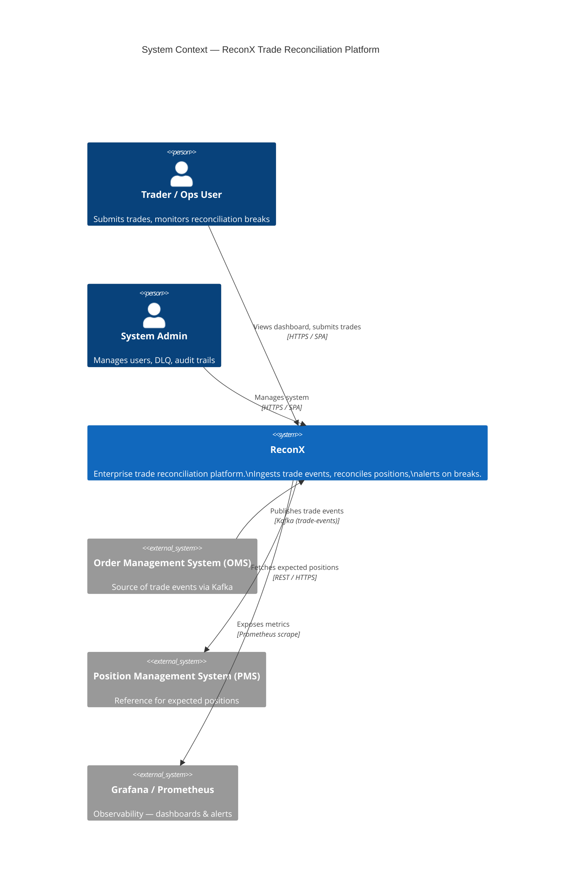
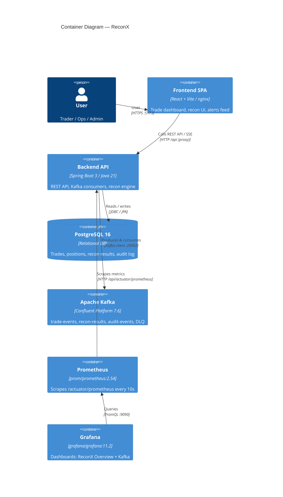
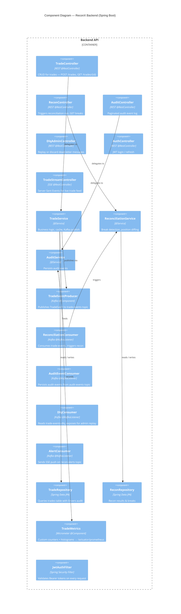

# ReconX — C4 Architecture Diagrams (ADV160)

Mermaid diagrams at the Context, Container, and Component levels.
Paste each block into [Mermaid Live Editor](https://mermaid.live) to render,
or view directly in any Markdown renderer that supports Mermaid (GitHub, VS Code, etc.).

---

## Level 1 — System Context

---

## Level 2 — Container Diagram

---

## Level 3 — Component Diagram (Backend)

